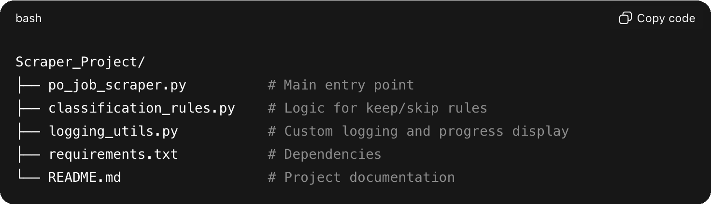

# Job Scraper Project

A personal project that helps me track job opportunities with structure, clarity, and consistent rules. It collects job links from several career boards, enriches them with logic I designed, and writes everything to CSV files that I can review quickly.

This project grew as I learned Python and explored ways to automate repetitive work. It reflects how I think about building tools: start simple, stay curious, and refine as new needs appear.

## Table of Contents
- [What the Scraper Does](#what-the-scraper-does)
- [Project Goals](#project-goals)
- [Current Features](#current-features)
- [Tech Stack](#tech-stack)
- [How to Run It](#how-to-run-it)
- [Future Improvements](#future-improvements)
- [Why I Built This](#why-i-built-this)

## What The Scraper Does
- Collects job links from supported boards
- Extracts attributes such as title, company, salary text, location, and posting dates
- Applies rules to classify each job as a keep or skip
- Logs progress and decisions in the terminal
- Writes final results to CSV files for easy sorting

## Project Goals
- Reduce repetitive effort during job searches
- Build structure around decision rules
- Improve accuracy and consistency
- Strengthen technical fluency through hands-on practice
- Explore how personal tools can support product thinking

## Current Features
- Support for multiple job boards
- Terminal logging with levels and progress indicators
- Keep and skip classification logic
- CSV output with clear data fields
- Salary extraction and rule evaluation
- Validation for date and location fields

## Tech Stack
- Python
- BeautifulSoup
- Requests
- CSV
- Logging
- GitHub version control
- Visual Studio Code

## Project Structure
Scraper_Project/

├── po_job_scraper.py           
├── classification_rules.py     
├── logging_utils.py            
├── requirements.txt            
└── README.md                   

## How To Run It
This scraper is designed for my own workflow, so it is not a packaged application.
The structure, logic, and outputs are open for anyone to explore.

To run it locally:
- git clone https://github.com/angespring/Scraper_Project
- cd Scraper_Project
- python3 -m venv venv
- source venv/bin/activate  # or venv\Scripts\activate on Windows
- pip install -r requirements.txt
- python po_job_scraper.py

## Future Improvements
- Cleaner separation of modules
- Additional job boards
- More robust salary parsing
- Expanded error handling
- Improved progress indicators
- Additional test coverage

## Why I Built This
This project began as a way to reduce friction in the job search process.
It became a space for experimentation, learning, and deeper technical thinking.
It reflects the same principles I bring to product work: reduce complexity, understand the workflow, and build tools that support better decisions.

---
If you're exploring scraping, automation, or product workflows, feel free to reach out or connect on LinkedIn.

https://www.linkedin.com/in/angespring/

## License
### MIT License
### See LICENSE for details

