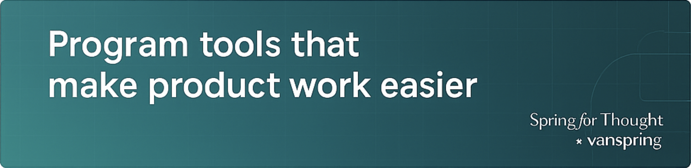
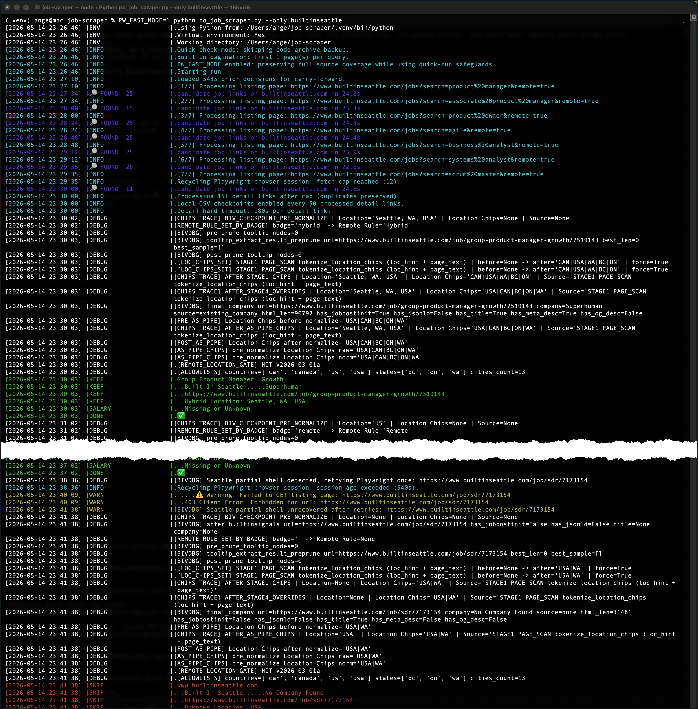
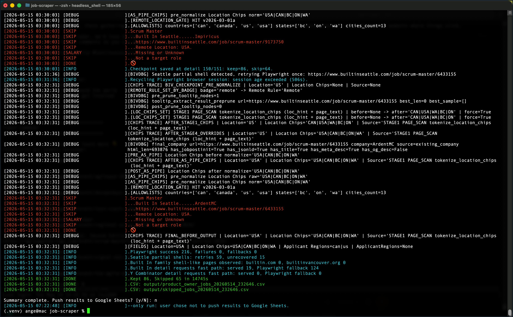

<p align="center">
  
</p>
<br>

# Jesse | Job Intelligence & Workflow Automation


A personal project that helps me track job opportunities with structure, clarity, and consistent rules. It collects job links from several career boards, enriches them with logic I designed, and writes everything to CSV files that I can review quickly.

This project grew as I learned Python and explored ways to automate repetitive work. It reflects how I think about building tools: start simple, stay curious, and refine as new needs appear.
<br>
<br>


## Table of Contents
- [Why This Exists](#why-this-exists)
- [What Jesse Does/Core Capabilities](#what-the-jesse-doescore-capabilities)
- [Project Goals](#project-goals)
- [Current Features](#current-features)
- [Example Classification Logic](#example-classification-logic)
- [Workflow Ecosystem](#workflow-ecosystem)
- [Architecture Philosophy](#architecture-philosophy)
- [Operational Visibility](#operational-visibility)
- [Product Thinking in Practice](#product-thinking-in-practice)
- [Design Principles](#design-principles)
- [Project Status](#project-status)
- [Tech Stack](#tech-stack)
- [Project Structure](#project-structure)
- [How to Run It](#how-to-run-it)
- [Future Improvements](#future-improvements)
- [Current Challenges & Learnings](#current-challenges--learnings)
- [Why I Built This](#why-i-built-this)
<br>


## Why This Exists
Most job searches create noise:
duplicate postings, inconsistent salary information, scattered tracking systems, and endless manual review.

This project was designed to reduce that noise.

Jesse acts as a lightweight job intelligence system that gathers opportunities, applies structured decision logic, and creates cleaner inputs for downstream workflows like resume tailoring, application tracking, and reporting.

The long-term goal is not just automation.
It is better decision-making through structured information.
<br>


## What Jesse Does/Core Capabilities
- Aggregates opportunities from multiple job platforms
- Extracts attributes such as title, company, salary text, location, and posting dates
- Applies rules to classify each job as a keep or skip
- Logs progress and decisions in the terminal
- Produces structured outputs for downstream review and analysis
<br>


<p align="center">
  
</p>
<br>


## Project Goals
- Reduce repetitive effort during job searches
- Build structure around decision rules
- Improve accuracy and consistency
- Strengthen technical fluency through hands-on practice
- Explore how personal tools can support product thinking
<br>


## Current Features
- Support for multiple job boards
- Terminal logging with levels and progress indicators
- Keep and skip classification logic
- CSV output with clear data fields
- Salary extraction and rule evaluation
- Validation for date and location fields
<br>


## Example Classification Logic
Jesse evaluates opportunities using rule-based filters such as:

- Salary thresholds
- Remote eligibility
- Duplicate detection
- Location normalization
- Title matching
- Platform-specific parsing rules

Example:
- Remote + salary range + product-related title → Keep
- Duplicate posting across multiple boards → Skip
<br>


## Workflow Ecosystem
Jesse is part of a broader personal workflow system:

- **Jesse**  
  Job intelligence and classification engine
- **Juno**  
  Structured job application workflow manager
- **Notie**  
  Notion-based tracking and operational workspace
- **Looker Studio**  
  Reporting and trend analysis

Together, these systems help transform a noisy job search into a more structured and repeatable workflow.
<br>


## Architecture Philosophy
This project is intentionally iterative.

Rather than attempting to build a perfect platform upfront, the system evolves through small experiments, workflow observation, and continuous refinement.

Key principles:
- Local-first processing where possible
- Rule-based transparency over black-box automation
- Human review remains part of the workflow
- Structured outputs over raw scraping
- Modular design for future expansion
- Product thinking applied to personal workflows
<br>


## Operational Visibility
Jesse emphasizes readable runtime output and operational transparency.

Structured logging, color hierarchy, progress tracking, warning recovery, and classification summaries make large processing runs easier to interpret during active development and testing.

Rather than hiding internal behavior, the system exposes decision-making and recovery steps in real time to support debugging, experimentation, and workflow trust.
<br>


<p align="center">
  
</p>
<br>


## Product Thinking in Practice
This project is not only about scraping jobs.

It is also an exercise in:
- workflow analysis
- operational design
- information architecture
- automation strategy
- iterative delivery
- system observability
- decision support tooling

The same thinking used in enterprise product work can also improve personal systems.
<br>


## Design Principles

- Prefer transparency over hidden automation
- Keep humans in the decision loop
- Build iteratively
- Optimize for signal over volume
- Treat workflows as products
<br>


## Project Status
Active and evolving.

This project is under continuous refinement as new workflows, classification logic, and operational patterns emerge.
<br>


## Tech Stack
- Python
- BeautifulSoup
- Requests
- CSV
- Logging
- GitHub version control
- Visual Studio Code
<br>


## Project Structure
```bash

Jesse Job Intelligence/
├── po_job_scraper.py          # Main entry point
├── classification_rules.py    # Logic for keep/skip rules
├── logging_utils.py           # Custom logging and progress display
├── requirements.txt           # Dependencies
└── README.md                  # Project documentation
 
```


## How To Run It
This is a personal learning and workflow project.
The architecture prioritizes experimentation, transparency, and iterative improvement over production-scale deployment.

To run it locally:
```bash

git clone https://github.com/angespring/jesse-job-intelligence
cd jesse-job-intelligence
python3 -m venv venv
source venv/bin/activate
pip install -r requirements.txt
python po_job_scraper.py

```


## Future Improvements
- Expanded rule-based scoring and confidence signals
- Better duplicate resolution across platforms
- Historical trend tracking
- Structured analytics dashboards
- Configurable workflow modes (test vs production)
- Improved modular architecture
- Lightweight API integrations
- Better orchestration between Jesse, Juno, and Notie
<br>


## Current Challenges & Learnings
This project has evolved through experimentation and iteration.

Some of the ongoing areas of exploration include:
- Managing duplicate detection across multiple boards
- Balancing scraping performance with rate limiting
- Designing scalable data structures for long-term tracking
- Separating operational logic from board-specific parsing
- Determining when spreadsheets stop being the right storage layer

The project intentionally embraces iterative improvement over premature perfection.
<br>


## Why I Built This
This project began as a way to reduce friction in the job search process.
It became a space for experimentation, learning, and deeper technical thinking.
It reflects the same principles I bring to product work: reduce complexity, understand the workflow, and build tools that support better decisions.
<br>


If you're exploring scraping, automation, or product workflows, feel free to reach out or connect on LinkedIn.
<br>
https://www.linkedin.com/in/angespring/
<br>
<br>


## License
MIT License<br>
See LICENSE for details
<br>
<br>
<br>
<br>


<br>


